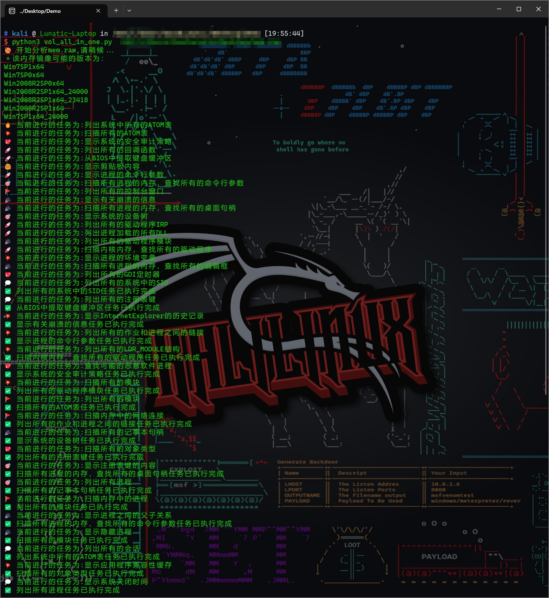

# Docker-Volatility
使用 Docker 一键构建 Volatility 内存取证环境

听很多人抱怨 Vol 的环境很难配，于是就动手做了这样一个简单的小项目，顺便也复习一下Docker (＾－＾)V

## 使用方法

```bash
git clone https://github.com/goodlunatic/Docker-Volatility.git
cd Docker-Volatility
docker build --tag Docker-Volatility:v1 .
docker run -d -p 2022:22 Docker-Volatility:v1 /bin/bash
service ssh start
```

然后使用终端连接软件连接运行的容器即可

```
ssh root@xxx.xxx.xxx.xxx:2022
```

之后就可以把内存检材上传到容器中进行内存取证了，因为有SSH连接，文件的上传和下载都十分方便

## Volatility2

Volatility2中已经加入很多第三方插件

已加入插件列表

- Mimikatz
- usbstor
- ......

除此之外，参考了[巨魔师傅的项目](https://github.com/Randark-JMT/memory-image-auto-analyzer)，自己写了一个 vol_all_in_one.py 放在 volatility 目录下

使用这个脚本可以自动运行 Vol2 的一些常见命令，免去了频繁的重复操作

```bash
# 使用方法如下
python3 vol_all_in_one.py 镜像的路径
```

使用效果图如下



## Volatility3

TODO

## 存在的一些问题

- 无法启动容器时就自动启动SSH
- docker-compose.yml 待完善